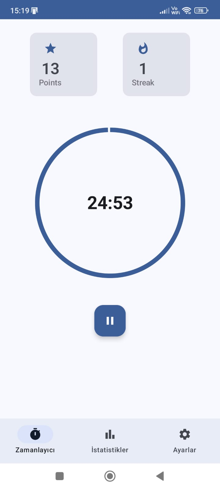

# Pomodoro Timer App

Modern ve kullanıcı dostu bir Pomodoro zamanlayıcı uygulaması.

## Ekran Görüntüleri

<div align="center">
  
  
  
</div>

## Özellikler

- 25/5 dakikalık klasik Pomodoro döngüsü
- Özelleştirilebilir çalışma ve mola süreleri
- Bildirim desteği
- Temiz ve modern kullanıcı arayüzü
- Koyu/Açık tema desteği

## Teknolojiler

- Kotlin
- Android Jetpack bileşenleri
- Material Design 3
- Gradle build sistemi

## Kurulum

1. Projeyi klonlayın:
```bash
git clone https://github.com/yourusername/Pomodoro.git
```

2. Android Studio'da projeyi açın

3. Gradle sync işlemini tamamlayın

4. Uygulamayı çalıştırın

## Gereksinimler

- Android Studio
- Android SDK
- Minimum Android API Level: 21 (Android 5.0)

## Katkıda Bulunma

1. Bu repository'yi fork edin
2. Yeni bir branch oluşturun (`git checkout -b feature/amazing-feature`)
3. Değişikliklerinizi commit edin (`git commit -m 'Add some amazing feature'`)
4. Branch'inizi push edin (`git push origin feature/amazing-feature`)
5. Bir Pull Request oluşturun

## Lisans

Bu proje MIT lisansı altında lisanslanmıştır. Daha fazla bilgi için `LICENSE` dosyasına bakın.

